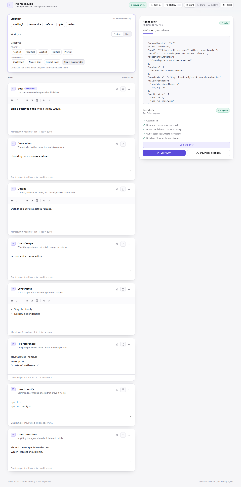
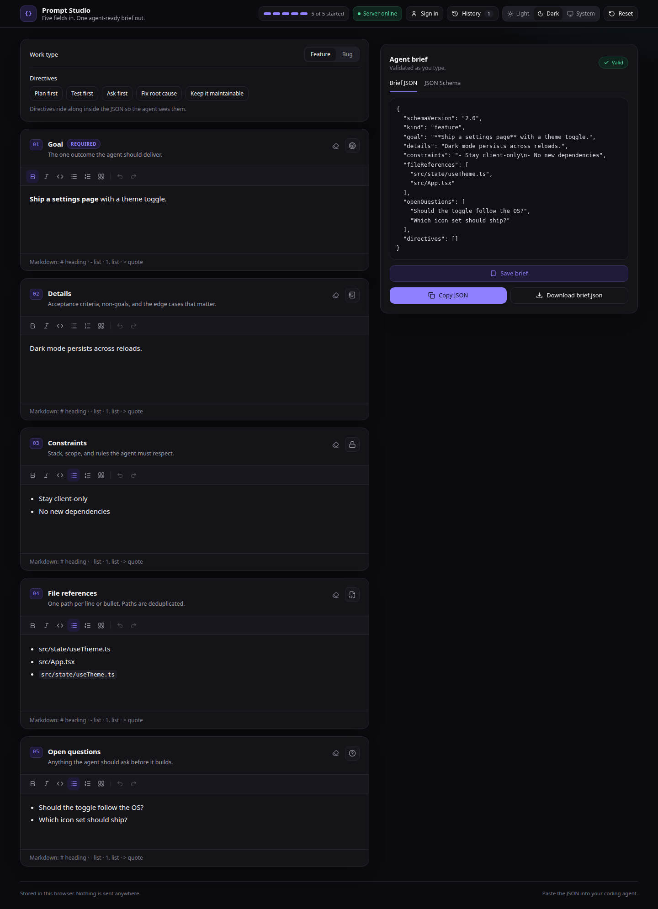

# Prompt Studio

Five fields in. One agent-ready brief out.

Write an issue or a goal, the details, constraints, file references, and open questions. Prompt Studio turns them into a validated JSON brief you can paste into a coding agent. Saved briefs live in your account, backed by MongoDB Atlas, or stay in the browser when you are signed out.






## What it does

- Five rich-text fields share one editor: bold, italic, inline code, bullet and numbered lists, quotes, headings, undo, and redo. Typing `- `, `1. `, `# `, or `> ` starts the matching block.
- A work-type toggle switches between feature and bug. The first field becomes Issue in bug mode, and the payload key becomes `issue`.
- Directive chips append their sentence to the payload: plan first, test first, ask first, or fix the root cause.
- The right panel updates on every keystroke with the JSON brief. Copy it or download `brief.json`.
- Clear one field with the eraser in its card. The toast offers Undo, and Ctrl+Z also restores it. The header Reset clears all five fields, the work type, and the autosaved draft.
- The JSON Schema tab shows the draft 2020-12 schema the payload is validated against. Zod generates both from one declaration.
- Create an account to save briefs to MongoDB Atlas. History is scoped to the account and follows you to any device.
- Signed-out use still works. Drafts and guest history stay in this browser.
- A server status pill shows `Server online`, `Waking server`, `Database offline`, or `Server offline`. Signed-in saves make one immediate attempt plus four retries when Render's free instance is waking.
- Light, dark, and system themes. The choice survives a reload.

## Run it

```sh
npm install
cp .env.example .env
# set MONGODB_URI in .env to your Atlas connection string
npm run dev
```

`npm run dev` starts the Vite app on http://localhost:5173 and the API on http://localhost:8787. Vite proxies `/api` so cookies stay same-origin. The dev runner refuses to start when either port is taken, restarts the API when it stops listening for 10 seconds, and stops both processes on Ctrl+C.

To run the production build locally:

```sh
npm run build
npm start
```

Open http://localhost:8787. Express serves the built SPA and the API from one origin.

```sh
npm test          # 79 unit tests
npm run typecheck
npm run lint
npm run build
```

## Accounts and storage

| Where | What | Key |
| --- | --- | --- |
| MongoDB Atlas | Users, sessions, saved briefs | `prompt_studio` database |
| Browser localStorage | Draft, guest history, theme | `prompt-studio.*` keys |

Signed in, Save writes `POST /api/history` and the drawer reads the account. Signed out, Save and the drawer use localStorage. Signing in does not upload existing guest entries.

Passwords use Node's scrypt with a random salt. Sessions are random tokens stored as SHA-256 hashes in Mongo, sent in an httpOnly `ps_session` cookie for 30 days. Logout deletes the session. Every history query filters by `userId`.

### API

| Method | Path | Auth | Result |
| --- | --- | --- | --- |
| GET | `/api/ping` | no | Liveness for Render |
| GET | `/api/health` | no | Server uptime and Mongo state |
| POST | `/api/auth/signup` | no | Create an account and session |
| POST | `/api/auth/login` | no | Sign in |
| POST | `/api/auth/logout` | no | Revoke the session |
| GET | `/api/auth/me` | no | Current user or `null` |
| GET | `/api/history` | yes | Newest 50 saved briefs |
| POST | `/api/history` | yes | Save one, or report a duplicate |
| DELETE | `/api/history/:id` | yes | Delete one owned brief |
| DELETE | `/api/history` | yes | Clear the account's history |

Validation, auth, and rate-limit failures return `{ "error", "code" }`.

## Cold start

Render's free web service sleeps after idle time. The first request can take 30 to 60 seconds while the instance boots. The app handles that in three places.

1. The status pill probes `/api/health` on load and shows `Waking server` while the probe hangs or fails once.
2. A signed-in save retries network errors and 502, 503, and 504 responses. It makes one immediate attempt, then retries at 0, 1.5, 4, and 8 seconds. Each attempt aborts after 65 seconds, and the toast says `Server is waking up. Retrying save.`
3. The drawer's list request uses the same retry policy, so history appears once the instance is awake.

The server starts its HTTP listener before Mongo connects. Routes that need the database return 503 until it is ready, and `/api/health` reports `connecting` or `error`. The server retries the Atlas connection every 5 seconds.

## Deploy to Render

`render.yaml` defines one free web service.

1. Push the repo to GitHub.
2. In Render, create a Blueprint from the repo.
3. Set `MONGODB_URI` to the Atlas connection string with the real password, and `APP_ORIGIN` to the Render URL, for example `https://prompt-studio.onrender.com`.
4. In Atlas, allow Render to connect. The simple option is a network access rule for `0.0.0.0/0`. The tighter option is the Render egress IPs for your region.
5. Deploy. Render builds with `npm ci --include=dev && npm run build` and starts `node dist-server/server/index.js`.

The build compiles the server to CommonJS in `dist-server`, writes a matching `package.json`, and bundles the SPA into `dist`. Express serves both.

## The payload

```json
{
  "schemaVersion": "2.0",
  "kind": "feature",
  "goal": "**Ship a settings page** with a theme toggle.",
  "details": "Dark mode persists across reloads.",
  "constraints": "- Stay client-only\n- No new dependencies",
  "fileReferences": ["src/state/useTheme.ts", "src/App.tsx"],
  "openQuestions": [
    "Should the toggle follow the OS?",
    "Which icon set should ship?"
  ],
  "directives": ["Create a plan only. Do not edit the codebase until the user approves the plan."]
}
```

| Field | Payload key | Shape |
| --- | --- | --- |
| Goal | `goal`, or `issue` in bug mode | Markdown string, required |
| Details | `details` | Markdown string |
| Constraints | `constraints` | Markdown string |
| File references | `fileReferences` | String array, one path per item, deduplicated |
| Open questions | `openQuestions` | String array, one question per item |

The `kind` field makes the payload a discriminated union: `feature` requires `goal`, `bug` requires `issue`. Selected directives land as full sentences in `directives`.

Prose fields keep inline formatting as Markdown. List fields flatten each top-level block and nested list item into one string. File paths lose wrapping backticks, quotes, list markers, and trailing punctuation before deduplication.

## How the data moves

```text
FieldEditor.onUpdate [1] ← one TipTap instance per field
├── useBriefDraft.setField [1a] ← replace one snapshot entry
│   ├── draft snapshot { docs, settings } [1a1]
│   │   ├── debounce 300 ms → localStorage draft [1a1a]
│   │   └── compileBrief(docs, settings) [1a1b] ← memoized per snapshot
│   │       ├── docToMarkdown(goal or issue, details, constraints) [1a1b1]
│   │       ├── docToItems(files).map(normalizePath) [1a1b2]
│   │       ├── dedupe file paths [1a1b3]
│   │       ├── directiveTexts(settings.directives) [1a1b4]
│   │       ├── BriefSchema.safeParse(candidate) [1a1b5] ← zod contract
│   │       └── JSON.stringify(value, null, 2) [1a1b6]
│   └── replace(docs, settings) on history load [1a2] ← remounts editors
├── OutputPanel [1b]
│   ├── Save brief [1b1] → useHistory.save [1b1a]
│   │   ├── signed out → localStorage [1b1a1]
│   │   └── signed in → POST /api/history with wake retry [1b1a2]
│   ├── Copy JSON [1b2] ← disabled until valid
│   └── Download brief.json [1b3]
├── HistoryDrawer [1c]
│   ├── account source → GET /api/history [1c1]
│   └── browser source → localStorage [1c2]
└── useAuth [1d] ← GET /api/auth/me, signup, login, logout
```

`shared/brief-docs.ts` validates documents and derives titles for both the browser and the server. `shared/api.ts` holds the wire types.

## Project layout

```text
server/             Express app, Mongo access, auth, history, tests
shared/             document validation, title derivation, wire types
src/
├── brief/          contract, registry, markdown serializer, compiler, tests
├── history/        pure entry model, relative time, tests
├── editor/         TipTap field, toolbar, action table
├── state/          auth, server status, history, draft, and theme hooks
├── lib/api.ts      fetch wrapper, typed routes, wake retry
├── ui/             form, output, history, auth, account, status, theme
├── App.tsx         header, grid, dialogs, toasts
└── styles.css      design tokens and editor typography
```

## Design

Colors and spacing live in `src/styles.css` as CSS variables mapped into Tailwind v4 through `@theme inline`. The `dark` class on `<html>` swaps the token set. An inline script in `index.html` applies the stored theme before first paint.

The layout is a two-column workspace at 1024 px and wider, and a single column below that. Every action button uses the same hover, pressed, focus, and disabled recipe. Enabled controls show a pointer, disabled controls show not-allowed, and reduced motion removes the transitions. The toolbar exposes `aria-pressed`, the output tabs follow the WAI-ARIA tabs pattern, and the auth dialog and history drawer share one focus-trap hook.

`src/brief/`, `src/history/`, and `shared/` import neither React nor the DOM, so they can move into a workspace package without edits.

## Stitch MCP

The original visual layer was built without Stitch because no Stitch MCP server or API key was configured in this environment. `docs/stitch.md` has the setup commands, the OpenCode config, and the prompt to regenerate the screen. The account dialog adds one more surface to that prompt.

## Verification

- `npm test` runs 79 unit tests across the serializer, schema, history model, password hashing, rate limiting, origin checks, and document validation.
- `npm run verify:api` runs 34 checks against a real local mongod: signup, sessions, save, duplicate detection, settings validation, two-user isolation, IDOR, delete, clear, logout, bad credentials, and origin rejection.
- `npm run verify:ui` runs 67 guest checks in Chrome, including pointer and disabled cursors, per-field clear, Undo, Ctrl+Z, bug mode, directives, and reduced motion.
- `npm run verify:auth` runs 25 account checks: signup, account save, sign-out, second-account isolation, history restore across reload, degraded and recovered status, retry after two simulated 503s, and screenshots.
- Run the server first for the browser scripts.
